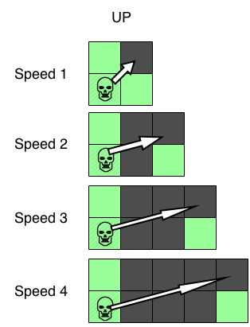

# The Goal

Excellent work! Thanks to you, we have managed to hijack four motorbikes! Their source code has been modified to carry our virus back to Bobnet.

Bobnet's headquarters are on the other end of the next bridge, but a recent acid rain storm has gravely damaged the structural integrity of the road, leaving it scattered with many holes.  
The motorbikes are perfectly capable of crossing the damaged bridge but, because of our virus, it's up to you to code the evasive maneuvers of the motorbikes.

Humankind is relying on you to see as many motorbikes safely across the bridge as possible!

---

## Rules

There are 4 lanes on the bridge road and 1 to 4 bikes to control. There can only be one moto per lane and they are always vertically aligned.

Each game turn, you can send a single instruction to every bike. Since the bikes operate on the same frequency, they will all synchronize on the commands you send them.

The possible commands are:

- **SPEED** to speed up by 1.
- **SLOW** to slow down by 1.
- **JUMP** to jump.
- **WAIT** to go straight on.
- **UP** to send all motorbikes one lane up.
- **DOWN** to send all motorbikes one lane down.

The starting speeds of the bikes are synced, and can be 0. After every game turn, the bikes will move a number of squares equal to their current speed across the X axis.

The UP and DOWN instructions will make the bikes move across the Y axis in addition to the movement across the X axis (Y = 0 corresponds to the highest lane). If a motorbike is prevented from moving up or down by the bridge's guard rails, none of the bikes will move on the Y axis that turn.

When a motorbike goes in a straight line and does not jump, if there is a hole between the current position and the next position (after the move), then the motorbike is lost forever. For example, if X=2 and S=3, the next position of the bike will have X=5: if there is a hole in X=3, X=4 or X=5, the bike will be destroyed.

Going up or down will put you at risk of falling in any hole situated in the black zone (consider the holes on the current and next lane):  

The mission is a **success** if the minimum amount of required bikes gets to the far side of the bridge.  
**You fail** if too many motorbikes fall into holes.  
**You fail** if the motorbikes do not cross the entire bridge after 50 turns.

---

## Game Input

The program must first read the initialization data from standard input. Then, within an infinite loop, read the data from the standard input related to the maze's current state and provide to the standard output the next movement instruction.

### Initialization Input

**Line 1**: M the amount of motorbikes to control.
**Line 2**: V the minimum amount of motorbikes that must survive.
**Lines 3**: through 6: the road ahead. Each line represents one lane of the road. A dot character **_._** represents a safe space, a zero **_0_** represents a hole in the road.

### Input for One Game Turn

**Line 1** : S the motorbikes' speed.
**_Next M lines_**: **_X Y A_** two integers and a boolean seperated by spaces. X, Y the coordinates of the motorbike on the road and A to indicate whether the motorbike is activated "1" or detroyed "0".

### Output for One Game Turn

A single line containing one of 6 keywords: **SPEED SLOW JUMP WAIT UP DOWN**.

---

## Constraints

The initial positions of the motorbikes are always **X=0**.  
0 ≤ **S** < 50  
1 ≤ **M** ≤ 4  
1 ≤ **V** ≤ M  
0 ≤ **X** < 500  
0 ≤ **Y** < 4  
Response time for one game turn ≤ 150ms
